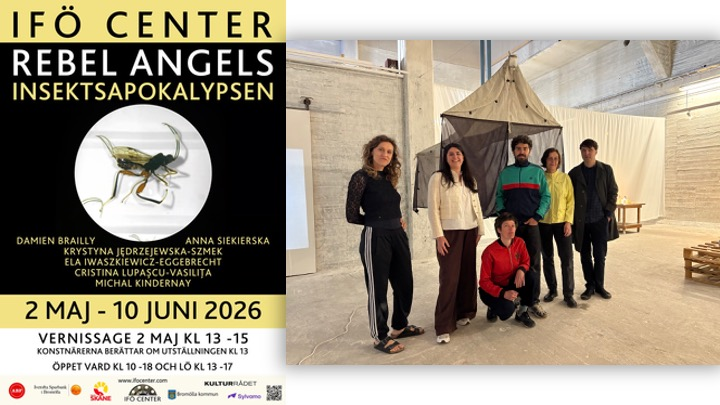
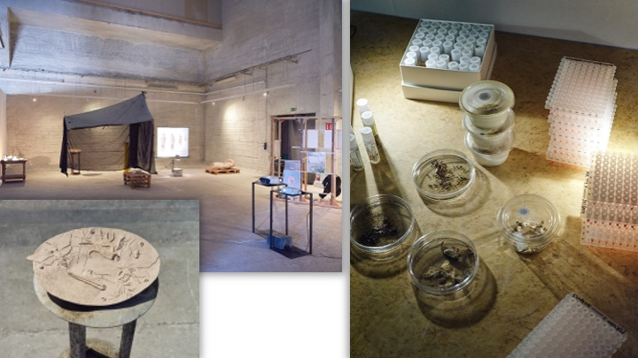
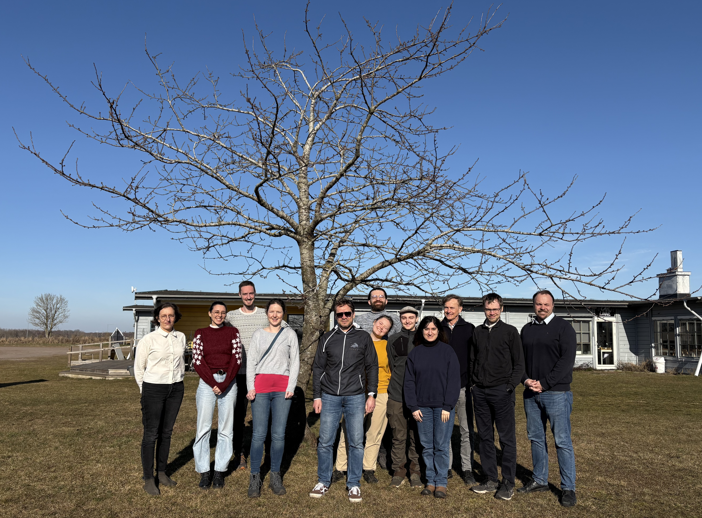
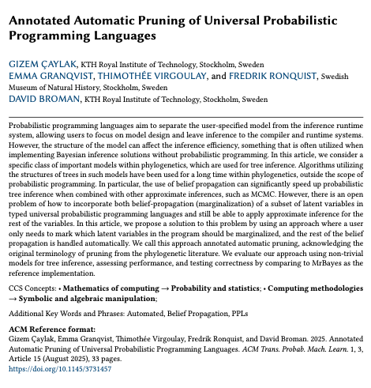

# News

### May 2026 

Part of the DarkTree team contributed to the scientific-artistic exhibition bringing together art and insect research in response to the global biodiversity crisis. Centering on insects as both ecological indicators and cultural symbols, the project examined how science and art can jointly engage with questions of environmental change and coexistence.

### March 2026 

*Annual project retreat on Öland. Discussions, presentations and hands-on workshops.*

### February 2026 
Viktor Palmkvist received the best poster award at the inauguration of the Department of Computing and Learning Systems. Title: “Reactive Graphs for Efficient Markov Chain Monte Carlo Inference”

### August 2025

New research article on how to make probabilistic tree inference more efficient. Title “Annotated Automatic Pruning of Universal Probabilistic Programming Languages”, published in ACM Transactions on Probabilistic Machine Learning, Volume 1, Issue, https://dl.acm.org/doi/full/10.1145/3731457.

### March 2025

*Project kick-off meeting on Öland. DarkTree team meets in person for the first time.*

