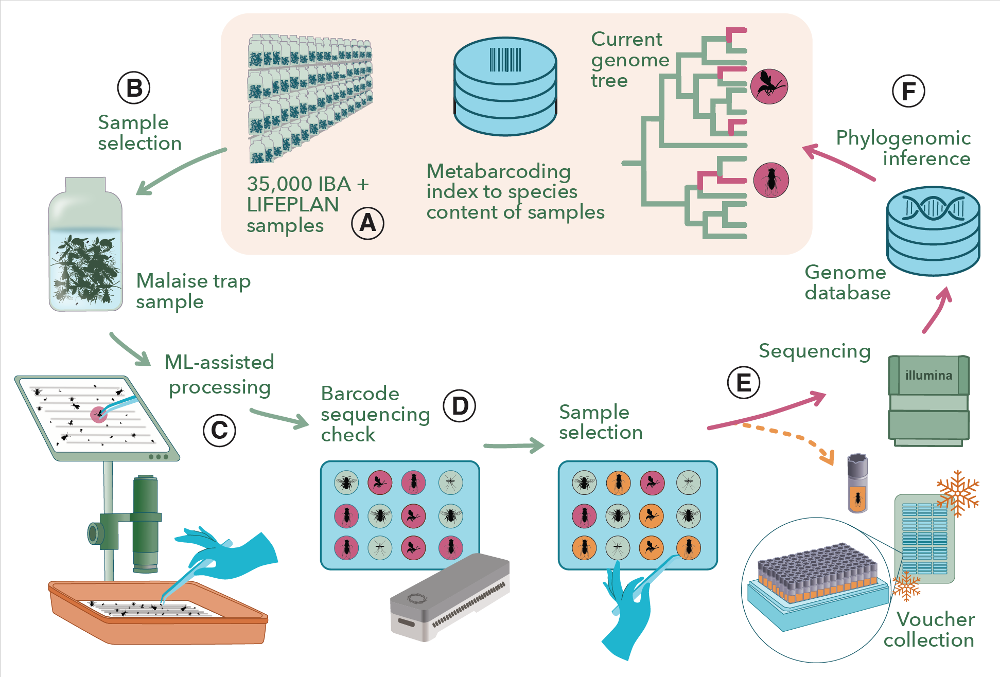

#  Building a Representative Genome Tree of Insects
Insects dominate life on Earth in both abundance and diversity, yet our understanding of their evolutionary history remains surprisingly incomplete. Advances in genome sequencing are transforming the life sciences, but applying these technologies to insects poses a fundamental challenge: how do we study a group that is not only hyperdiverse, but also profoundly under-described?
For decades, global insect diversity was estimated at around 5.5 million species, with only one in five formally described. Recent large-scale inventories using DNA metabarcoding suggest that true insect diversity is likely far greater, possibly reaching tens of millions, with previously understudied “dark taxa” being far more diverse than previously suspected. These discoveries reveal that our knowledge of the insect tree of life is far more fragmented and biased than previously assumed. Ironically, current genome sequencing efforts often reinforce these biases by focusing on well-known, easily sampled lineages—leaving vast regions of insect genome diversity unexplored.
The DarkTree project aims to close these gaps by building a more representative insect genome tree. We will leverage the unique global insect collections generated by the Insect Biome Atlas [https://www.insectbiomeatlas.org/] and LIFEPLAN [https://www.slu.se/en/research/research-catalogue/projekt/l/lifeplan/] projects. In total, the material comprises more than 20,000 samples, containing tens of millions of insects representing hundreds of thousands of species. Crucially, the species composition of each sample has already been characterized using DNA metabarcoding. This allows us to bypass traditional taxonomic bottlenecks and systematically select genomes in a way that reflects real insect diversity.
To achieve this, we will develop and integrate innovative methods across the entire workflow. These include machine-learning approaches for visual detection and identification of target specimens, documentation of voucher specimens through synchrotron-based micro-CT scanning, as well as new probabilistic machine learning methods for combining genomic and metabarcoding data, and scaling up Bayesian phylogenomic analyses to handle the large datasets generated.

Fig. 1. Overview of the DarkTree workflow.

Beyond fundamental evolutionary biology, the project will establish a new foundation for monitoring and assessing global insect biomes. By advancing automated species identification and improving the accuracy of biodiversity assessments using environmental DNA, DarkTree will directly support more reliable reporting of biodiversity change in a rapidly transforming world.
The ultimate aim is to reshape how we study insect evolution, moving from a biased and fragmented picture toward a comprehensive, data-driven understanding of the most diverse animal group on the planet.
A large focus in the project is on data generation and methods development. We will also be exploring several research directions in collaboration with several groups outside the core project team. We are open to more such collaborations. The current plans focus on five major directions:
1.	Probabilistic integration of genomic and metabarcoding data to reconstruct the insect tree of life at a scale never before attempted.
1.	Machine learning of genome–phenome relationships across the full breadth of insect diversity.
1.	The first robust analyses of true insect diversification through geological time, informed by representative genomic sampling.
1.	Discovery of novel evolutionary processes and genomic signatures in previously unexplored insect lineages.
1.	New insights into the diversity and evolution of insect symbionts, a key but understudied component of insect biology.

# Publications:
- Annotated Automatic Pruning of Universal Probabilistic Programming Languages [https://dl.acm.org/doi/full/10.1145/3731457]

<!-- 
Comment part this is not show in the web site
 -->
